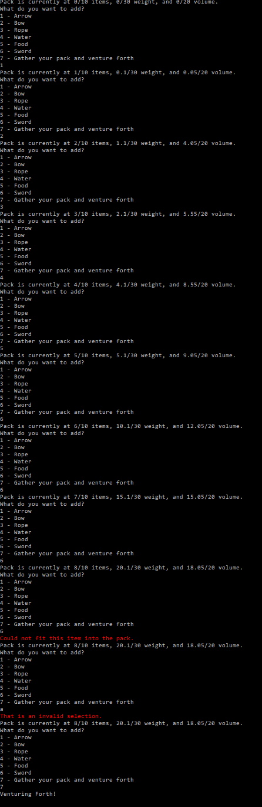

# Assignment 3 – Inventory Packing

## Value (%)

This assignment is worth 10% of your course grade.

## Task

In this assignment, you are tasked with implementing a `Pack` class, an `InventoryItem` base class, and several derived classes representing different items. The goal is to create a functional system to manage a pack that has constraints on the number of items it can hold, its maximum volume, and its maximum weight.

Here's an overview of what you need to accomplish:

1. Implement the `InventoryItem` base class, which should store the item's weight and volume.
2. Implement the derived classes (`Arrow`, `Bow`, `Rope`, `Water`, `Food`, and `Sword`), initializing them with the correct weight and volume values.
3. Implement the `Pack` class, which should store an array (or other data structure) of `InventoryItem` objects, as well as the pack's maximum count, maximum volume, and maximum weight.
4. Implement the `Add` method for the `Pack` class to add items to the pack, ensuring that the pack's constraints are not exceeded.
5. Implement the `ToString` method for the `Pack` class to provide a user-friendly representation of the pack and its contents.
6. Write unit tests for the `Pack` and `InventoryItem` classes, covering various scenarios and edge cases.
7. Use the provided `PackTester` class to interactively test your `Pack` and `InventoryItem` implementations, ensuring they work as expected.

## How to Complete This Assessment

1. **Implement `InventoryItem` class**: Start by implementing the `InventoryItem` class. You will need to add properties to represent the item's name, weight, and volume. Include a constructor to initialize these properties, as well as any other methods or properties needed.

2. **Implement derived classes**: For each of the derived classes (Arrow, Bow, Rope, Water, Food, Sword), implement a constructor that calls the base class constructor with the appropriate arguments for each specific item type (e.g., name, weight, volume). See [Details](#inventory-item-details). This should be a single line of code for each derived class.

3. **Implement `Pack` class constructor**: In the `Pack` constructor, initialize the `_items` array or another data structure of your choice. The constructor should take in parameters for `maxCount`, `maxVolume`, and `maxWeight` to limit the number of items and their total weight and volume that can be added to the pack.

4. **Implement `Add` method**: In the `Add` method, check if adding the item would exceed the pack's maximum count, weight, or volume. If it would not exceed these limits, add the item to the pack and return `true`. Otherwise, return `false`.

5. **Implement `ToString` method**: In the `ToString` method, create a string representation of the pack, including information about the items in the pack, their properties, and any relevant pack constraints (e.g., maximum count, weight, volume). See the [output](#how-to-submit-your-assessment) for the expected behaviour of this method.

6. **Test the classes**: Finally, test each class by creating instances of the `InventoryItem` derived classes and adding them to a `Pack` object. Ensure that the `Add` method correctly handles items that would exceed the pack's constraints and that the `ToString` method provides the expected output.

### Unit Tests

When testing your `Pack` class and its methods, consider the following test cases to ensure the correctness of your implementation:

1. **Constructor**: Test if the `Pack` constructor initializes the object correctly with the specified max count, max volume, and max weight.

2. **Add method**:
   - Test adding a single item to an empty pack.
   - Test adding multiple items within the pack's constraints (max count, max volume, and max weight).
   - Test adding items exceeding the pack's constraints, ensuring that the `Add` method returns `false` and does not add the item.
   - Test adding items exactly at the pack's constraints.

3. **Edge cases**:
   - Test the behavior of the `Pack` class when given negative values for max count, max volume, and max weight.
   - Test the behavior when adding items with negative weight or volume.
   - Test the behavior when adding items with zero weight or volume.

If you run into problems, make sure to also test the derived `InventoryItem` classes and their getters to ensure they are initialized correctly.

### PackTester Class

In this assignment, you are provided with a `PackTester` class that can be used to help verify your `Pack` and derived `InventoryItem` classes work correctly.

The `PackTester` class contains a static method `AddEquipment(Pack pack)`. This method takes an instance of `Pack` as a parameter and provides a console interface for the user to interact with the pack. The user can add different items to the pack, and the program will display the current state of the pack.

You can use the `PackTester` class as follows:

1. Create an instance of the `Pack` class with the desired max count, max volume, and max weight.
2. Call the `PackTester.AddEquipment()` method and pass the `Pack` instance as an argument.

This will allow you to interactively test your `Pack` and `InventoryItem` implementations, ensuring they work as expected. You can add various items to the pack, and the program will display any error messages if the pack constraints are exceeded or if an invalid choice is made.

## Inventory Item Details

| Class | Weight | Volume |
|-------|--------|--------|
| Arrow | 0.1    | 0.05   |
| Bow   | 1      | 4      |
| Rope  | 1      | 1.5    |
| Water | 2      | 3      |
| Food  | 1      | 0.5    |
| Sword | 5      | 3      |

## How to Submit Your Assessment

Submit a link to the GitHub repo containing your code and an image of the output when you use your `Pack` in the `PackTester` class. An example image is below.

## Grading Rubric

### Results (70%)

| Points | Description                                                                                   |
|:------:|-----------------------------------------------------------------------------------------------|
|   7    | Excellent: Thorough test coverage including edge cases; all tests pass.                      |
|   6    | Good: Comprehensive test coverage with some edge cases; majority of tests pass.              |
|   5    | Satisfactory: Adequate test coverage; more than half of tests pass.                          |
|   3    | Needs Improvement: Limited test coverage; less than half of tests pass.                      |
|   1    | Poor: No tests or minimal tests; none of the tests pass.                                     |
|   0    | Code does not build in the CI workflow.                                                       |

### Class/Method/Variable Naming (10%)

| Points | Description                                                                                   |
|:------:|-----------------------------------------------------------------------------------------------|
|   1    | Excellent: Consistent, meaningful, and clear naming conventions for all classes, methods, and variables. |
|  0.75  | Good: Mostly consistent and meaningful naming conventions; minor inconsistencies or unclear names. |
|  0.5   | Needs Improvement: Inconsistent naming conventions; some unclear or confusing names.          |
|   0    | Poor: No clear naming conventions; many unclear or confusing names.                           |

### Comments/Documentation (10%)

| Points | Description                                                                                   |
|:------:|-----------------------------------------------------------------------------------------------|
|   1    | Excellent: Comprehensive comments and documentation; easy to understand the purpose and functionality of code. |
|  0.5   | Needs Improvement: Some comments and documentation, but lacking clarity or detail in certain areas. |
|   0    | Poor: No comments or documentation; difficult to understand the purpose and functionality of the code. |

### Formatting (10%)

| Points | Description                                                                                   |
|:------:|-----------------------------------------------------------------------------------------------|
|   1    | No formatting is required during the formatting workflow.                                     |
|  0.25  | Minimal formatting is required during the formatting workflow.                                |
|   0    | Extensive formatting is required during the formatting workflow.                              |
